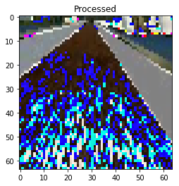
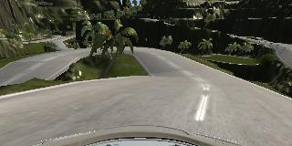
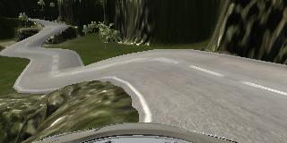
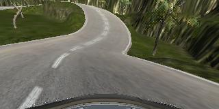

# Behavioral Cloning

---

The goals / steps of this project are the following:
* Use the simulator to collect data of good driving behavior
* Build, a convolution neural network in Keras that predicts steering angles from images
* Train and validate the model with a training and validation set
* Test that the model successfully drives around track one without leaving the road
* Summarize the results with a written report

---

## Project Files

My project includes the following files:
* model.py containing the script to create and train the model
* drive.py for driving the car in autonomous mode
* model.h5 containing a trained convolution neural network 

model.py will require the following directories of data:
* data - Sample dataset provided Udacity for this project
* data_reg - Data from center lane driving behavior for Track 1 of the Udacity simulator
* data_edge - Data for recovery maneuvers should the car veer off the edge of the road for Track 1 of the Udacity simulator
* data_reverse - Data of of center lane driving heading the opposite way on Track 1 of the Udacity simulator
* track2_reg - Data from center lane driving behavior for Track 2 of the Udacity simulator
* track2_edge - Data for recovery maneuvers should the car veer off the edge of the road for Track 2 of the Udacity simulator
* track2_reverse - Data of of center lane driving heading the opposite way on Track 2 of the Udacity simulator

If you only have one folder of data, then you can change the line:
```python
data_dirs = ['data', 'data_reverse', 'data_edge', 'data_reg', 'track2_reg', 'track2_edge', 'track2_reverse']
```

### Driving the car
Using the Udacity provided simulator and my drive.py file, the car can be driven autonomously around the track by executing 
```sh
python drive.py model.h5
```

I modified the top speed of the car to be around 15mph to get it around the track faster. 

## Model Architecture and Training Strategy

I used the Nvidia model referenced in [here](http://images.Nvidia.com/content/tegra/automotive/images/2016/solutions/pdf/end-to-end-dl-using-px.pdf).

My model starts with 3 layers of pre-processing:
1. Normalization: This will help bring the range of pixel values (0-255) to a range (-0.5 to 0.5) that helps our network converge towards a low error as it learns [info](https://stats.stackexchange.com/questions/185853/why-do-we-need-to-normalize-the-images-before-we-put-them-into-cnn).
1. Cropping: Since the bottom 25 pixels include the head of the car and the top 40-70 pixels contain the sky/trees, we can crop these out to reduce the size of the data we're feeding into our network.
1. Resize: I decided to resize the image in order to further reduce the size of the data I'm feeding into the first layer of the network.
```python
def resize(x):
    # https://discussions.udacity.com/t/keras-lambda-to-resize-seems-causing-the-problem/316247/2
    from keras.backend import tf as ktf
    return ktf.image.resize_images(x, (80, 160))
```

The following layers are as describe in the Nvidia paper. 

| Layer         		|     Description	        					| 
|:---------------------:|:---------------------------------------------:| 
| Input         	    | (80, 160, 3) image | 
| Convolution 5x5     	| 24 filters, 2x2 stride, valid padding	|
| RELU					| |
| Convolution 5x5     	| 36 filters, 2x2 stride, valid padding	|
| RELU					| |
| Convolution 5x5     	| 48 filters, 2x2 stride, valid padding	|
| RELU					| |
| Convolution 3x3     	| 64 filters, 1x1 stride, valid padding	|
| RELU					| |
| Convolution 3x3     	| 64 filters, 1x1 stride, valid padding	|
| RELU					| |
| Flatten				| |
| Fully connected      	| Output: 100 |
| Dropout             	| Drop Prob: 0.2 |
| Fully connected      	| Output: 50 |
| Dropout             	| Drop Prob: 0.2 |
| Fully connected      	| Output: 10 |
| Fully connected      	| Output: 1 |


Here is the Keras implementation of the final model:
```python
model = Sequential()
# Normalization
model.add(Lambda(lambda x: x/255.0 - 0.5, input_shape=input_shape))
# Crop image
model.add(Cropping2D(cropping=((40, 25), (0, 0))))
# Resize image
model.add(Lambda(resize))
model.add(Conv2D(24, kernel_size=(5,5), strides=(2,2), activation='relu'))
model.add(Conv2D(36, kernel_size=(5,5), strides=(2,2), activation='relu'))
model.add(Conv2D(48, kernel_size=(5,5), strides=(2,2), activation='relu'))
model.add(Conv2D(64, kernel_size=(3,3), strides=(1,1), activation='relu'))
model.add(Conv2D(64, kernel_size=(3,3), strides=(1,1), activation='relu'))
model.add(Flatten())
model.add(Dense(100))
model.add(Dropout(0.2))
model.add(Dense(50))
model.add(Dropout(0.2))
model.add(Dense(10))
model.add(Dense(1))
```

I used Kera's EarlyStopping callback method for it to decide when to stop based on the changes in the loss. I set the min delta to be really small so between two epochs, it was to have at least this small a delta between their losses in order to stop.
```python
early_stop = EarlyStopping(min_delta=0.0001)
```

Here are the results after running the training with early stop:
```
718/717 [==============================] - 68s - loss: 0.0788 - val_loss: 0.0572
Epoch 2/10
718/717 [==============================] - 65s - loss: 0.0599 - val_loss: 0.0535
Epoch 3/10
718/717 [==============================] - 64s - loss: 0.0564 - val_loss: 0.0535
```

### Addressing overfitting

I added the two dropout layers in the network because I was seeing that the model was overfitting my training data. I chose 0.2 after starting with 0.5 for the dropout rate because with the 0.5 drop out the car keep going off the side of the road.

I first trained on the sample data Udacity provided for track 1, then created my own regular driving data and edge case data to better generalized the model.

The model used an adam optimizer, so the learning rate was not tuned manually (model.py line 111).

### Using Python generators to train
I used a Python generator, which loads image data as it is needed instead of all at once in order to save on memory space on my training machine. As a result, I was able to verify a lot of model design by running the training on the full dataset on my laptop without having to upload to a cloud GPU server.

### Tuning the model
I split the dataset into training and validation sets (80-20 split) in order to verify that my model is doing what it should by looking at the training vs validation loss after each epoch. I save the output to a csv log for everytime I run training with the CSVLogger call back built into Keras.

```python
csv_logger = CSVLogger('model_training-1.log')
model.fit_generator(train_generator,
                    steps_per_epoch=len(train_samples)/generator_batch_size,
                    validation_data=validation_generator,
                    validation_steps=len(validation_samples)/generator_batch_size,
                    epochs=10,
                    callbacks=[csv_logger, early_stop])
```

### How I arrived at using the current model architeture

The overall strategy for deriving a model architecture was to start with a simple network then scale up the convolution layers as necessary to make the model more generalizable.

My first step was to use a convolution neural network model with 1 layer of convolution and reduce the size of my input data. So I took the last 4 dense layers of the Nvidia architecture and put a convolution layer ahead of it.

Here is that simple model architecture:
```python
model = Sequential()
# Normalization
model.add(Lambda(lambda x: x/255.0 - 0.5, input_shape=input_shape))
# Crop image
model.add(Cropping2D(cropping=((60, 30), (0, 0))))
# Resize image to (64,64)
model.add(Lambda(resize))
model.add(Conv2D(64, kernel_size=(5, 5), strides=(2, 2), activation='relu'))
model.add(Flatten())
model.add(Dense(100))
model.add(Dense(50))
model.add(Dense(10))
model.add(Dense(1))
```

The input size was cropped heavily and scaled down to 64x64.

Here's the orignal input:


Here is the normalized, cropped, and resized input:



I found that my first model had a low mean squared error on the training set but a high mean squared error on the validation set. This implied that the model was overfitting. 

In order to offset the overfitting, I added dropout layers after the Dense(100) and Dense(50) layer:
```
model.add(Flatten())
model.add(Dense(100))
model.add(Dropout(0.2))
model.add(Dense(50))
model.add(Dropout(0.2))
model.add(Dense(10))
model.add(Dense(1))
```

I also augmented the center camera image dataset by adding a horizonally flipped version of the image and reversing the steering angle for that image.

```python
images.append(np.fliplr(image))
angles.append(-steering_angle)
```

After training I saw that the car was often driving straight where it should turn. I looked the distribution of the data and saw that there was a large amount of data where the steering angle was 0. 

So while reading the data in, I randomly drop 80% of the dataset where the steering angle was close to 0:

```python
should_add_image = False
if abs(steering_angle) <= 0.2:
    if np.random.random() < 0.2:
        should_add_image = True
else:
    should_add_image = True
```

After this the car drove okay but still had a hard time recovering from the edges of the road in track 1. I added in the left and right camera images as well to help correct the car shoulds its center image see the road as a left or right image would. To correct for the offset of the left and right camera, I assumed they were mounted at the same distance on each side away from center and chose 0.2 as the correction factor after some trial and error.

```python
lr_correction = 0.2
left = load_image(line[1], folder)
images.append(left)
angles.append(steering_angle + lr_correction)

right = load_image(line[2], folder)
images.append(right)
angles.append(steering_angle - lr_correction)
```

At this point, the vehicle is able to drive autonomously around the track without leaving the road. However, I notice that the vehicle oscillates betwen the left and right side of the road a lot. While this meets the requirements of staying on the road, it would be a nightmare car to ride in. This might have to do with my harsh drop of data with steering angles near 0.

I tried to correct for this behavior by dropping out less data with 0 steering angles, but this led me back to instances the car going straight when it should have turned. 

I decided to capture more data on what the car should do and feed it into my simple network. I captured driving in the opposite direction on the track, recovering from edges, a lot of smooth turning examples. (See below for the training data capture process)

The model didn't improve much even with more data. In addition, I found that the simple model couldn't handle test data I fed in from the second track, it was not generalized enough. I needed a more complex model to turn more smoothly at the appropriate time.

Instead of building toward the Nvidia architexture one convolution layer at a time, I decided to adopt the whole model now that I have a decent set of data. This let me focus more time on data gathering and preprocessing instead of tuning the network one layer at a time.

Instead of 1 convolution layer, the Nvidia architecture has 5. I modified the size of the image input as well to (80, 160) instead of (64, 64) because I thought the more convolution layers will be able to find more nuances in the larger image size.

The final complex model oscillated less than the simple model and was able to drive around the first track in a smooth manner. However it's very well trained on only the first track. As soon as I use it on the second track, it fails often. Time to gather more training data!

##  Training data creation

For each track, my dataset consists of:
* At least 2 laps of center lane driving
* 1 - 2 laps of center lane driving in the opposite direction
* Recovery driving at different points in the course

Here is an example image of center lane driving from the center camera:


I also augmented the data with left and right camera images and steering angle corrections:

Here are some examples of the left and right camera images for the same frame as the center camera above:


I then recorded the vehicle recovering from the left side and right sides of the road back to center so that the vehicle would learn to correct itself should it veer off into the side. Here's a sequence of images that shows the vehicle recovering from the right side of the road.


I also record 1-2 laps of the vehicle driving the opposite direction on the same track. This helps generalize the model better.

Here's a frame from the reverse driving! Luckily I was the only driver on this road :)


I repeated this process on track 2 in order to get more data points. Track 1 as relatively flat and free to sharp turns compared to track 2.

Here are some images from track 2:






To augment the data sat, I also flipped images and angles thinking that this would add robustness to the dataset. I had already collected reverse driving data but this would help the model with new roads outside of track 1 and 2. Here are some samples of the original and flipped images for track 1 and 2:


After the collection process, I had 22955 data points. I then preprocessed this data by:
1. Converting the color space to RGB fro BGR to make the model.py because the drive.py uses PIL to load the image whereas in model.py it uses OpenCV. The default color space when PIL loads is RGB and for OpenCV it was BGR.
1. Normalizating the pixel values to between -0.5 and 0.5.
1. Cropping the hood of the car and the sky
1. Resizing the image

Here's an original image before preprocessing:


Here's it after normalization:


Here's it after cropping:


Here's it after resizing:


I randomly shuffled the data set and put 20% of the data into a validation set. The validation set helped determine if the model was over or under fitting. 

After training the model, I tested it on the track 1 and 2 of the simulator. I recorded the runs and noted where the car had trouble staying on the road. There is a danger of making the model less generalized by overfitting the test set if I continue to add data that takes care of the 'trouble' areas. Instead I tune my network and introduce more general center lane driving to help.

In the end I was able to get the model to drive the car on both tracks at 18mph. At 30mph, the car was able to keep on the first track but went off the edge on the second track. I suspect this is due to both my local computer unable to keep up and that I need to add throttle control as well to the model to make race the second track.


